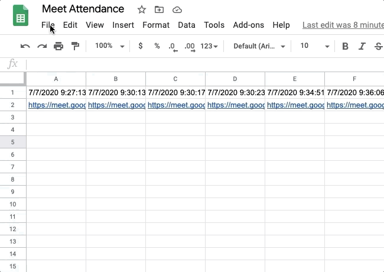

# meet-attendance
*Read this in portuguese: [Português](README.pt.md)*

Project to help teachers knowing which students were present during a whole online class.

Some teachers use [Google Meet](https://meet.google.com/) for online classes. They need to make a roll call a few times during class and then see which students were present at all or most of the checks.
This project has an assumption of using [Meet Attendance](https://chrome.google.com/webstore/detail/meet-attendance/nenibigflkdikhamlnekfppbganmojlg) add-on during the online class.

## Tutorial
- After generating the spreadsheet with [Meet Attendance](https://chrome.google.com/webstore/detail/meet-attendance/nenibigflkdikhamlnekfppbganmojlg) add-on, download it in `.csv` format:

