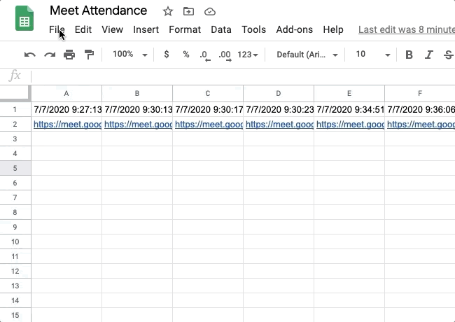

# meet-attendance
*Read this in English: [English](README.md)*

Projeto para auxiliar professores a saberem quais estudantes estavam presentes durante toda uma aula online.

Alguns professores utilizam [Google Meet](https://meet.google.com/) para aulas online. Eles precisam fazer a chamada dos alunos algumas vezes durante a aula e, após o término, verificar quais alunos estavam presentes em todas a chamadas ou na maioria delas.
Esse projeto assume que a extensão [Meet Attendance](https://chrome.google.com/webstore/detail/meet-attendance/nenibigflkdikhamlnekfppbganmojlg) é utilizada durante as aulas online.

## Tutorial
- Após gerar a planilha com a extensão [Meet Attendance](https://chrome.google.com/webstore/detail/meet-attendance/nenibigflkdikhamlnekfppbganmojlg), faça o download no formato `.csv`:

